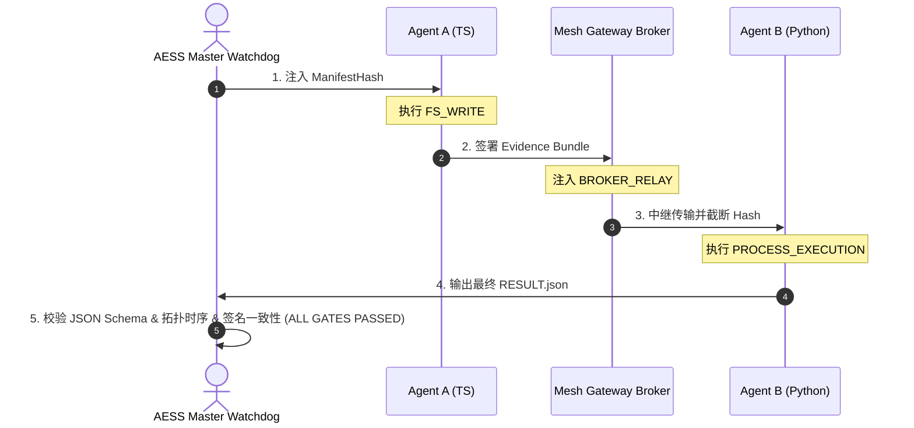

# AESS (Agent Execution Safety System)

> **工业级 Agent 运行时动态安全审计与能力防线门控系统**

---

## 📢 最新更新与 Bug 修复 (2026-07-02)

### 🆕 新增功能
- **AESS v2.1.2-mvp.3.5 独立项目发布**：正式作为独立工程在 GitHub 开源。本版本锁定 Genuine Schema 验证断言与安全 Heredoc 防注入机制。
- **一键自动化集成与校验管道**：提供 `setup_aess.sh` 脚本，可实现 Agent A (TS)、Python Broker、Agent B (Py) 和 aess-cli 校验器的端到端部署、运行与 Conformance 审计。
- **动态-静态双轨能力对齐**：提供了与编译期 `@grant` 对齐的运行时能力控制注册表机制。

### 🐛 修复问题
- **Silent Fallback Vulnerability 彻底杜绝**：移除静默降级假阳性漏洞，若校验环境缺失 `jsonschema` 等依赖，门控程序直接抛出退出码 1 熔断。
- **Windows-WSL 换行符 CRLF 管道净化**：修复了在 Windows 宿主机与 WSL 互操作环境下 python 打印 manifestHash 携带 `\r` 字符导致 Node.js 脚本产生未闭合字符串 SyntaxError 的缺陷。

---

## 1. 项目简介

**AESS** 是一套专为分布式 AI Agent 协作、AST 转译（如 Xiaoqinli）以及自动化代码生成设计的运行时安全校验和能力卡关系统。在 AI 自动驾驶（YOLO 模式）流水线中，AESS 充当最后的看门狗，通过物理哈希链与 JSON Schema 合规门控，防范静默数据损坏、重排攻击以及非授权特权执行。



---

## 2. 核心架构与断言机制

AESS 通过以下四层关卡实现无后门的实质性合规：

1.  **安全预检 (Pre-flight Check)**：在执行任何破坏性清理（如 `rm -rf`）前，校验 `requirements.md` 密码学拓扑标识，防止在错误路径或根目录下误删宿主机资产。
2.  **Heredoc 强类型非展开机制**：除必需动态传参的脚本外，所有资产配置文件采用 `<< 'EOF'` 强类型存根，彻底切断 Bash 变量展开注入与语义污染。
3.  **时序拓扑断言 (Topological Assertions)**：Agent B 必须对接收到的证据链进行强时序匹配。证据链必须严格符合 `["FS_WRITE", "BROKER_RELAY", "PROCESS_EXECUTION"]` 的时空时序。
4.  **真理防线 (Compliance Verification)**：`aess` 校验器不仅验证 Schema，还会重新计算 `requirements.md` 与 `capability.yaml` 的联合 SHA256 哈希，与证据链中的 `manifestHash` 进行强对齐，确保代码未被篡改。

---

## 3. 快速开始与一键运行

项目已高度集成化。您只需在本地 Bash 环境中执行以下一键启动脚本，即可完成全量依赖Provision及全管线大闸审判：

```bash
# 赋予执行权限并强制覆写运行
chmod +x setup_aess.sh
./setup_aess.sh --force
```

### 预期成功输出

当所有安全断言、哈希链和契约校验均完美通过后，流水线将抛出 `0` 退出码，并打印以下真理通过标志：

```text
--- Step 4: Watchdog Master Gate Ultimate Review ---
[+] AESS Conformance Verification Level 1 (v2.1.2)
[+] Conformance Schema Contract Verification: PASS
[ ALL GATES PASSED] Global semantic consistency verified. Locked against Manifest: 0eb9fa464ecfa17e

=== [ ALL GATES PASSED ] PARADOXES SOLVED. REPRODUCIBILITY COMPLETE ===
```

---

## 4. 文件树拓扑结构

*   `AESS/specification/requirements.md`：核心规约声明。
*   `AESS/registries/capability.yaml`：运行时特权与令牌注册表。
*   `AESS/schemas/result-2.1.schema.json`：合规报告的 JSON Schema 规约。
*   `AESS/toolchain/aess-cli/aess`：Python 编写的主卡关逻辑门控。
*   `AESS/examples/cross-agent-demo/`：TS/JS/Python 代理间的数据流协作示例。

<!-- AESS Auto-Deployment Iteration: 1 at 2026-07-02 23:22:38 -->
